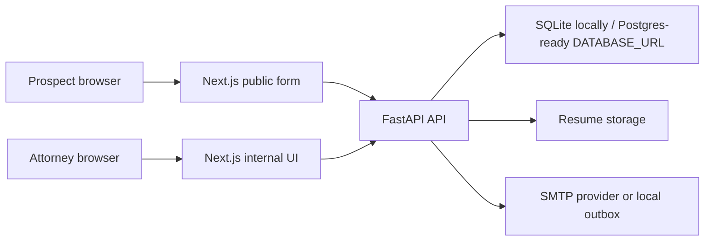

# System Design

## Goals

The system supports two workflows: a public prospect intake form and an authenticated internal attorney review UI. The public workflow prioritizes low-friction submission. The internal workflow prioritizes fast lead review and a clear follow-up state transition.

## Architecture

## Backend

FastAPI owns validation, persistence, authentication, upload handling, and email delivery. Public lead creation is unauthenticated at `POST /api/leads`. Internal routes require a bearer token generated by `POST /api/auth/login`, and the frontend verifies that token through `GET /api/auth/me` before rendering attorney pages. Internal users are persisted in the database with salted PBKDF2 password hashes, active flags, and roles. On local startup, the app seeds one initial attorney from environment variables if no matching user exists.

Primary API endpoints:

- `POST /api/leads`: create a lead from multipart form data.
- `POST /api/auth/login`: authenticate an internal attorney.
- `GET /api/auth/me`: verify the current internal session.
- `GET /api/leads`: list all leads for internal users.
- `GET /api/leads/{id}`: read one lead for internal users.
- `PATCH /api/leads/{id}/reach-out`: transition a lead to `REACHED_OUT`.

FastAPI was chosen because the assignment requires it and because it gives a concise, typed API surface with generated OpenAPI docs for quick local review at `/docs`.

## Data Model

`Lead` stores prospect contact fields, resume metadata, state, timestamps, and follow-up audit fields.

Lead states:

- `PENDING`: default state after public submission.
- `REACHED_OUT`: set manually by an attorney.

The app uses SQLite locally for simple setup and SQLAlchemy so the same shape can move to Postgres through `DATABASE_URL`.

SQLite was chosen for the default local path because it avoids extra infrastructure during the timed exercise. SQLAlchemy keeps persistence concerns isolated enough to replace SQLite with Postgres without changing the API contract or frontend.

## Resume Storage

Uploaded resumes are validated by allowlisted MIME type and capped by size. The app never trusts the original filename as a storage path. It generates a server-side filename and stores the original filename only for display.

## Email

Email delivery is abstracted behind `EmailService`. If SMTP settings are present, the service sends through SMTP. Otherwise, messages are written as text files under `backend/data/outbox`, which makes local verification deterministic and avoids sending real email during demos.

The app persists the lead before notification. In a production version, email failures should be retried asynchronously with a job queue and surfaced to operations without losing the lead.

## Auth

Internal auth uses database-backed users, salted PBKDF2 password hashes, active-user checks, role checks, and signed JWT bearer tokens. The configured initial attorney is only a bootstrap path for local/demo setup. In a larger production deployment, this can be replaced or fronted by SSO or a managed identity provider, with audit logs, enforced MFA, and centralized user lifecycle management.

## Security Considerations

- Internal data is protected by backend auth checks, not only frontend navigation.
- Resume filenames are sanitized and storage keys are generated server-side.
- Upload size and MIME type are validated.
- Secrets are configured through environment variables.
- CORS is restricted to the configured frontend origin.
- Public lead creation should get rate limiting and spam protection before production traffic.

## Tradeoffs

- SQLite and local file storage make the app easy to run inside the assignment window; Postgres and object storage are better production defaults.
- A direct SMTP/local outbox adapter is simpler than a queue; production email should be asynchronous with retries.
- Client-side localStorage token storage is quick for a demo; production should use secure, HTTP-only cookies or managed auth.

## Local Verification Path

The intended end-to-end proof is:

1. Run the backend and frontend locally.
2. Submit a lead through the public form.
3. Confirm the lead exists in the internal UI after login.
4. Confirm local email files are created in `backend/data/outbox`.
5. Mark the lead as `REACHED_OUT`.
6. Confirm the internal UI reflects the updated state.
