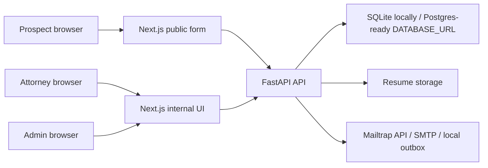

# System Design

## Goals

The system supports two workflows: a public prospect intake form and an authenticated internal attorney review UI. The public workflow prioritizes low-friction submission. The internal workflow prioritizes fast lead review and a clear follow-up state transition.

## Architecture

## Backend

FastAPI owns validation, persistence, authentication, upload handling, assignment, and email delivery. Public lead creation is unauthenticated at `POST /api/leads`. Internal routes require a bearer token generated by `POST /api/auth/login`, and the frontend verifies that token through `GET /api/auth/me` before rendering internal pages. Internal users are persisted in the database with salted PBKDF2 password hashes, active flags, and roles. On local startup, the app seeds one bootstrap admin from environment variables if no matching user exists.

Primary API endpoints:

- `POST /api/leads`: create a lead from multipart form data.
- `POST /api/auth/login`: authenticate an internal user.
- `GET /api/auth/me`: verify the current internal session.
- `POST /api/auth/register`: create a pending attorney account.
- `GET /api/auth/attorneys`: admin-only list of pending and approved attorneys.
- `PATCH /api/auth/attorneys/{id}/approve`: admin-only approval of a pending attorney.
- `GET /api/leads`: list all leads for internal users.
- `GET /api/leads/{id}`: read one lead for internal users.
- `PATCH /api/leads/{id}/reach-out`: transition a lead to `REACHED_OUT`.

FastAPI was chosen because the assignment requires it and because it gives a concise, typed API surface with generated OpenAPI docs for quick local review at `/docs`.

## Data Model

`Lead` stores prospect contact fields, resume metadata, state, timestamps, assignment fields, and follow-up audit fields.

Lead states:

- `PENDING`: default state after public submission.
- `REACHED_OUT`: set manually by an attorney.

`User` stores internal identity and lifecycle fields:

- `ADMIN`: active internal user allowed to approve attorneys and inspect all leads.
- `PENDING_ATTORNEY`: self-registered attorney awaiting admin approval; cannot log in.
- `ATTORNEY`: approved active attorney allowed to log in and work assigned leads.

The app uses SQLite locally for simple setup and SQLAlchemy so the same shape can move to Postgres through `DATABASE_URL`.

SQLite was chosen for the default local path because it avoids extra infrastructure during the timed exercise. SQLAlchemy keeps persistence concerns isolated enough to replace SQLite with Postgres without changing the API contract or frontend.

## Resume Storage

Uploaded resumes are validated by allowlisted MIME type and capped by size. The app never trusts the original filename as a storage path. It generates a server-side filename and stores the original filename only for display.

## Assignment

Lead assignment uses Option B, capacity-based routing. On lead submission, the backend selects an active approved attorney with the fewest currently pending assigned leads. Ties are broken by least recent assignment and then deterministic email ordering. The selected attorney is persisted on the lead with an assigned timestamp before notification emails are generated.

This is a production-oriented improvement over a hardcoded internal email because it creates ownership, supports multiple attorneys, and keeps inactive or unapproved accounts out of routing. If no active attorney exists, lead creation fails with a service-unavailable response so the prospect is not given a false success while no owner can receive the case.

Rejected for this assignment: sending all attorney notifications to one hardcoded email. That would satisfy a narrow reading of "an attorney inside the company" but would not support Alma's approval workflow, capacity management, or auditability.

Future improvement Option D is AI-assisted assignment. Alma could later classify case type, urgency, language, jurisdiction, and attorney expertise from structured intake data or resume metadata, then use that recommendation as an input to routing. That should be implemented as an explainable recommendation layer with human override, not as an opaque automatic decision. The present build documents Option D but intentionally keeps routing deterministic and testable.

## Email

Email delivery is abstracted behind `EmailService`. The backend attempts Mailtrap API first when `MAILTRAP_API_TOKEN`, `MAILTRAP_FROM_EMAIL`, and `MAILTRAP_FROM_NAME` are present. If `MAILTRAP_USE_SANDBOX=true`, it sends through the Mailtrap Sandbox endpoint `https://sandbox.api.mailtrap.io/api/send/{inbox_id}` using `MAILTRAP_INBOX_ID`. If the Mailtrap API path is not configured, it attempts SMTP when SMTP variables are present. If neither hosted provider path is configured, messages are written as text files under `backend/data/outbox`, which makes local verification deterministic and avoids sending real email during demos.

Mailtrap Sandbox messages appear in Mailtrap Email Testing / Sandbox, not Gmail. Sandbox is recommended for the demo because it captures both customer and attorney messages regardless of recipient address. Real Mailtrap Email Sending with `demomailtrap.co` can only send to the Mailtrap account owner in this setup, so it is less useful for showing arbitrary customer and attorney recipients.

Mailtrap Sandbox free plans can throttle back-to-back API sends. When sandbox mode is enabled, `MAILTRAP_SEND_DELAY_SECONDS` defaults to `6.0`. The backend sends the customer confirmation first, waits for that short delay, then sends the assigned-attorney notification. This keeps the demo reliable while making the two-email requirement visible in the sandbox inbox.

The Mailtrap API token is not the same secret as Mailtrap SMTP credentials. Mailtrap SMTP sandbox remains an alternate demo path if SMTP settings are configured, and local outbox remains the provider-free fallback.

If Mailtrap API returns a permission error such as `403`, the app keeps a local outbox copy of the emails and the lead submission flow should not crash. This preserves the assignment workflow and gives the operator something concrete to verify even when provider credentials are wrong or under-permissioned.

The app persists the lead and assignment before notification. The prospect receives a confirmation email saying the submission was received and explaining the next step. The assigned attorney receives the internal case notification.

The attorney email includes:

- Customer name
- Customer email
- Lead ID
- Resume/CV filename or reference
- Assigned timestamp

The prospect email intentionally does not disclose internal attorney assignment details. Alma can choose to disclose attorney ownership later, but the safer default is to avoid promising a specific attorney before the internal workflow is ready for that communication.

In a production version, email failures should be retried asynchronously with a job queue and surfaced to operations without losing the lead. Provider tokens and SMTP passwords must stay in environment variables, must not be committed in `backend/.env`, and should be rotated after any demo where a token was pasted into a visible surface.

## Auth

Internal auth uses database-backed users, salted PBKDF2 password hashes, active-user checks, role checks, and signed JWT bearer tokens. A bootstrap admin is created from `BOOTSTRAP_ADMIN_EMAIL` and `BOOTSTRAP_ADMIN_PASSWORD` so there is a controlled first administrator without allowing arbitrary public admin creation.

New attorneys register through the public registration flow, but registration only creates a pending inactive account. A bootstrap or existing admin must approve the account before it can log in or receive assigned leads. This prevents an internet user from self-promoting into the internal Alma workspace.

In a larger production deployment, this can be replaced or fronted by SSO or a managed identity provider, with audit logs, enforced MFA, stronger password policy, invite-only registration, and centralized user lifecycle management.

## Security Considerations

- Internal data is protected by backend auth and role checks, not only frontend navigation.
- Pending attorneys cannot log in or receive assignments.
- Only active approved attorneys are eligible for capacity-based routing.
- Resume filenames are sanitized and storage keys are generated server-side.
- Upload size and MIME type are validated.
- Secrets are configured through environment variables.
- CORS is restricted to the configured frontend origin.
- Public lead creation should get rate limiting and spam protection before production traffic.

## Tradeoffs

- SQLite and local file storage make the app easy to run inside the assignment window; Postgres and object storage are better production defaults.
- A direct Mailtrap API, SMTP, or local outbox adapter is simpler than a queue; production email should be asynchronous with retries.
- Client-side localStorage token storage is quick for a demo; production should use secure, HTTP-only cookies or managed auth.
- Capacity-based assignment is deterministic and explainable but does not yet account for specialization, urgency, language, or jurisdiction.

## Local Verification Path

The intended end-to-end proof is:

1. Run the backend and frontend locally.
2. Register a new attorney and confirm the account cannot log in before approval.
3. Log in as the bootstrap admin and approve the attorney.
4. Submit a lead through the public form.
5. Confirm customer and assigned-attorney emails are visible through Mailtrap or preserved in `backend/data/outbox`.
6. Log in as the approved attorney and confirm the assigned lead exists in the internal UI.
7. Mark the lead as `REACHED_OUT`.
8. Confirm the internal UI reflects the updated state.

## Assignment Traceability

- Original lead workflow: public lead creation, authenticated list/detail, and manual `REACHED_OUT` update.
- Original required fields: first name, last name, email, and resume/CV.
- Original email requirement: prospect confirmation plus attorney notification.
- Production repository shape: separate backend, frontend, docs, tests, env examples, and service boundaries.
- Alma decisions: env-bootstrap admin, attorney self-registration, pending admin approval, active-attorney capacity assignment, no hardcoded attorney recipient, customer confirmation email, assigned-attorney notification email, and Option D AI-assisted assignment documented for later.
